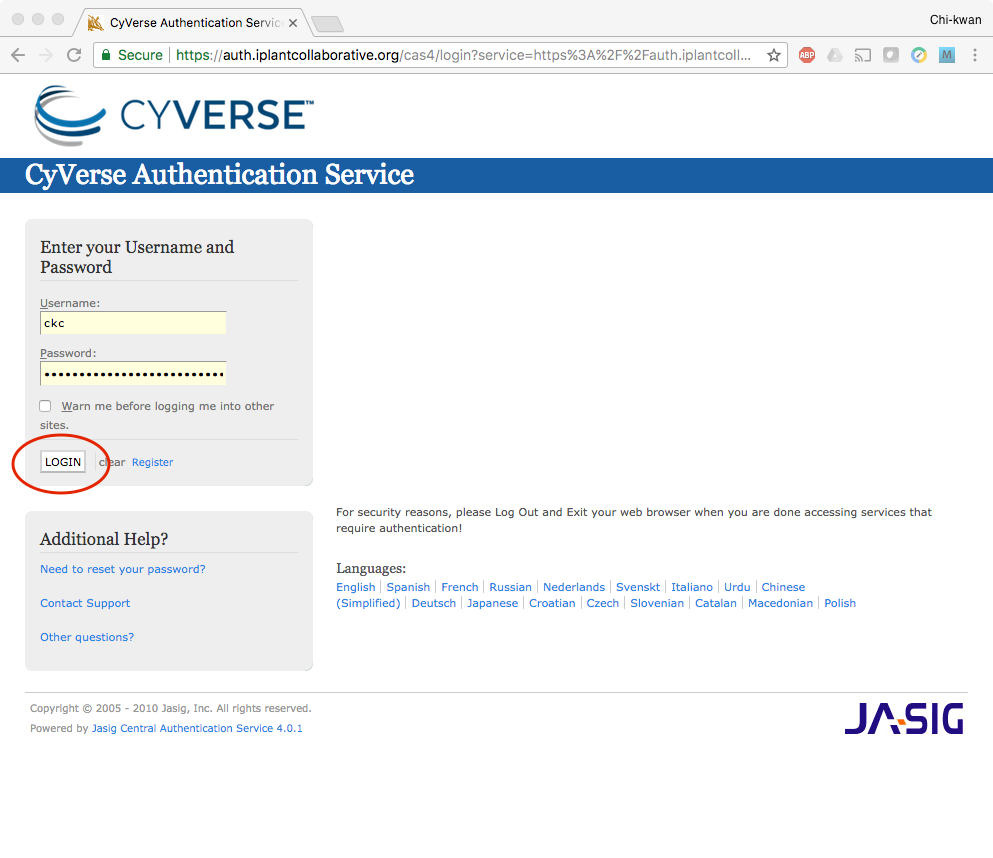

**Booting an Atmosphere computer instance for your use!**
=========================================================

What we're going to walk through how to start up a running computer (an "instance") on the CyVerse Atmosphere Cloud service.

Below, we've provided screenshots of the whole process. You can click on them to zoom in. The important areas to fill in are highlighted.

First, go to the `Atmosphere <https://atmo.cyverse.org/application/images>`_ application and then click `login`

.. important::

  As descrbied in the `pre-workshop setup <../getting_started/installation.html>`_, you need to have access to the CyVerse Atmosphere Cloud. If you are not able to log-in for some reason, please let us know and we will fix it immediately.

1. Fill in the username and password and click "LOGIN"

- Fill in the username, which is your CyVerse username, and then enter the password (which is your CyVerse password).

|atmo-1|

2. Select the "Projects" tab and then click the "CREATE NEW PROJECT" button

- This is something you only need to do once.

- A project is a workspace that lets you keep things together.

- Click on the "Projects" tab on the top and then click the "CREATE NEW PROJECT" button

|atmo_cp0|

- Enter the name "Astrocontainers" into the Project Name and put something simple like "CyVerse AstroContainers Workshop, May 2018" into the description. Then click "CREATE".

|atmo_cp|

3. Select the newly created project

- Click on your newly created project.

- Click "NEW" and then "Instance" from the dropdown menu to start up a new virtual machine.

|atmo_launch0|

- Search for "docker" in the "Show All" tab; click the "Ubuntu 14_04 w Docker CE" image.

|atmo_launch1|

- Name your virtual machine something simple such as "tutorial" and select an appropriate instance size, such as "medium3 (CPU: 4, Mem: 32GB, Disk: 240GB)".

- Leave rest of the fields as default.

|atmo_launch|

- Wait for it to become active

- It will now be booting up! This will take 2-10 minutes. Just wait! Don't reload or do anything.

|atmo-6|

- One the virtual machine is ready, the "Status" column will turn green and described as "Active".

- Click on your new instance's name to get more information!

- Now, you can either click "Open Web Shell", *or*, if you know how to use ssh, you can ssh in with your CyVerse username on the IP address of the machine

|atmo-7|

4. **Deleting your instance**

- To completely remove your instance, you can select the "Delete" button from the instance details page.

- This will open up a dialogue window. Select the "Yes, delete this instance" button.

|atmo-8|

- It may take Atmosphere a few minutes to process your request. The instance should disappear from the project when it has been successfully deleted.

|atmo-9|

.. Note::

  It is advisable to delete the machine if you are not planning to use it in future to save valuable resources. However if you want to use it in future, you can suspend it.

.. |atmo_cp0| image:: ../img/atmo_cp0.png
  :width: 750
  :height: 648

.. |atmo_launch1| image:: ../img/atmo_launch1.png
  :width: 750
  :height: 648

.. |atmo-7| image:: ../img/atmo-7.png
  :width: 750
  :height: 648

.. |atmo-8| image:: ../img/atmo-8.png
  :width: 750
  :height: 648

