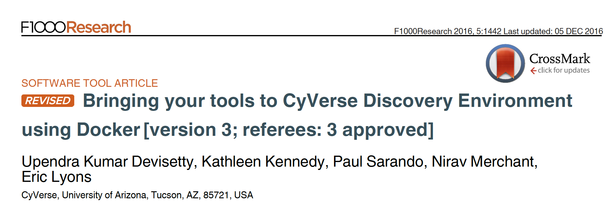
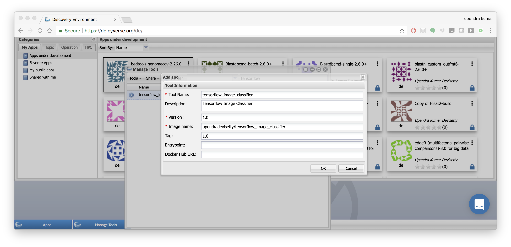
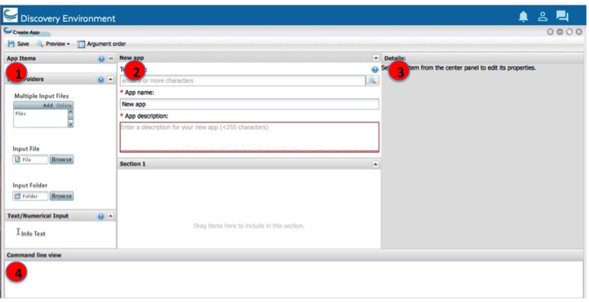
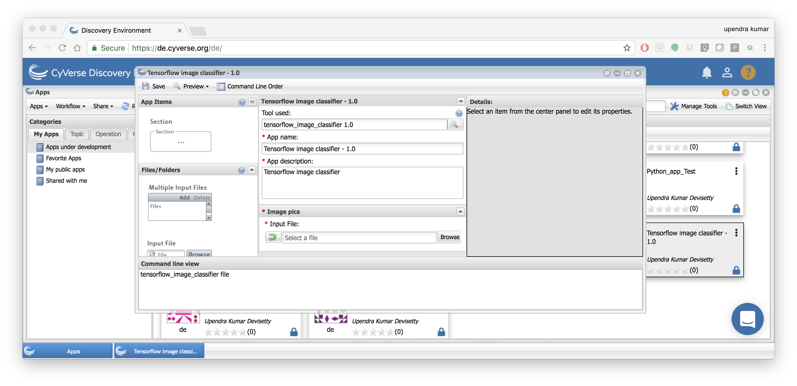

**Deploying apps in Discovery Environment**
-------------------------------------------

The CyVerse Discovery Environment (DE) provides a simple yet powerful web portal for managing data, analyses, and workflows. The DE uses containers (via Docker and Singularity through Agave) to support customizable, non-interactive, reproducible workflows using data stored in the CyVerse Data Store, based on iRODS. Agave is a "Science-as-a-Service" API platform for high-performance computing (HPC), high-throughput computing (HTC) and big-data resources.

Deploying Docker images as apps in DE
~~~~~~~~~~~~~~~~~~~~~~~~~~~~~~~~~~~~~~

Instruction guide: This paper will guide you to bring your dockerized tools into CyVerse DE. 

https://f1000research.com/articles/5-1442/v3

|f1000|

.. Note::

	Significant changes have been made as to how you can bring your tools into DE and so we are working on a separate paper that will show all those changes. Meanwhile you can follow the below tutorial for integrating your tools.

Here are the basic steps for deploying Docker images as apps in DE. For this tutorial I am going to show an example of Tensor image classifier docker image that I dockerized and pushed to dockerhub.

- `Build and test your Docker images`_

- `Push your Docker image to public repositories`_

- `Add Docker images as tool in DE`_

- `Create a UI for the tool in DE`_

- `Test the app using appropriate test data`_

.. warning::

	If you already have your own Docker image or Docker image of interest is hosted on public repositories (Dockerhub or quay.io or some other public repository), then you can skip to step 3 

.. _Build and test your Docker images:

**1. Build and test your Docker images**

The first step is to dockerize your tool or software of interest. Detailed steps of how to dockerize your tool and test your dockerized images can be found in sections `intro to docker <../docker/dockerintro.html>`_ and `advanced docker <../docker/dockeradvanced.html>`_. 

For this tutorial I will use the ``tensorflow image classifier`` docker image that I built using this `code <https://github.com/upendrak/tensorflow_image_classifier>`_

Testing 

.. code-block:: bash

	docker run -v $(pwd):/data -w /data tensorflow_up:1.0 sample_data/16401288243_36112bd52f_m.jpg

.. _Push your Docker image to public repositories:

**2. Push your Docker image to public repositories**

Once the Docker image works then you can push those images to some public repository such as `dockerhub <http://hub.docker.com>`_ or `quay.io <http://quay.io>`_

.. _Add Docker images as tool in DE:

Here is the docker image for the tensorflow image classifier on docker hub - https://hub.docker.com/r/upendradevisetty/tensorflow_image_classifier/

**3. Add Docker images as tool in DE**

All tools now run installed as Docker images in the DE. Once the software is dockerized and available as Docker images on dockerhub then you can add those docker images as a tool in DE.

.. warning::

	Check if the tool and correct version are already installed in the DE by following the below steps.

	- Log in to the Discovery Environment by going to https://de.cyverse.org/de/, entering your CyVerse username and password, and clicking LOGIN. If you have not already done so, you will need to sign up for a CyVerse account.
	- Click the ``Apps`` window to open the Apps window.
	- Click the ``Manage Tools`` button on the top-right of the Apps window.
	- In the search tools field, enter the first few letters of the tool name and then click enter.
	- If the tool is available then you can skip to skip to step 3 for creating a UI for that tool.

If the tool is not available in DE then do the following:

- Click open the ``Tools`` tab in ``Manage Tools`` window and then click ``Add tools`` button

- Then enter the fields about your tool and then click "Ok". 
	
	- Tool Name: It should be the name of the tool. For example "tensorflow_image_classifier".
	- Description: A short Description about the tool. For example "Tensorflow image classifier".
	- Version: What is the version number of the tool. For example "1.0".
	- Image name: Name of the Docker image on dockerhub or quay.io. For example "upendradevisetty/tensorflow_image_classifier".
	- Tag: What is the tag of your Docker image. This is optional but is highly recommended. If non specified, it will pull the default tag ``latest``. If the ``latest`` tag is not avaiable the tool integration will fail. For example "1.0"
	- Entrypoint: Do you want a entrypoint for your Docker image? This optional. 
	- Docker Hub URL: URL of the Dockerhub docker image. Option but is recommended. In this example "".

|img_building_1|

- If there is no error, it indicates successful integration of the tool.

.. _Create a UI for the tool in DE:

**4. Create a UI for the tool in DE**

Once the Dockerized tool is added, you can create the app UI for the tool. The ``Create App`` window consists of four distinct sections:

- The first section contains the different app items that can be added to your interface. To add an app item, select the one to use (hover over the object name for a brief description) and drag it into position in the middle section.
- The second section is the landing place for the objects you dragged and dropped from the left section, and it updates to display how the app will look when presented to a user.
- The third section (Details) displays all of the available properties for the selected item. As you customize the app in this section, the middle section updates dynamically so you can see how it will look and act.
- Finally, the fourth section at the bottom (Command line view) contains the command-line commands for the current item’s properties. As you update the properties in the Details section, the command-line view updates as well to let you make sure that you are passing the correct arguments in the correct order.

|img_building_4|

.. Note::

	Creating a new app interface requires that you know how to use the tool. With that knowledge, you create the interface according to how you want options to be displayed to a user. 

Here is an example of the ``Tensorflow image classifier - 1.0`` app UI in DE

|img_building_3|

.. _Test the app using appropriate test data:

**5. Test the app using appropriate test data**

After creating the new app according to your design, test your app in the your Apps under development folder in the DE using appropriate test data to make sure it works properly.

- If your app works the way you expect it to you can share your app or make the app public
- If your app doesn't work, then you may need to make changes to the app UI or you need to make changes to your Docker image. If you make changes to the Docker image, then you don't need to create a new app UI again as the Docker image updates will be propagated automatically.

