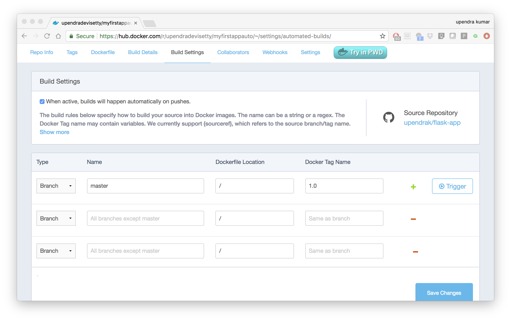
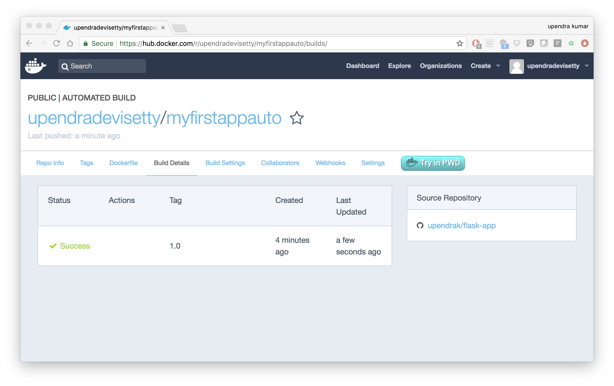
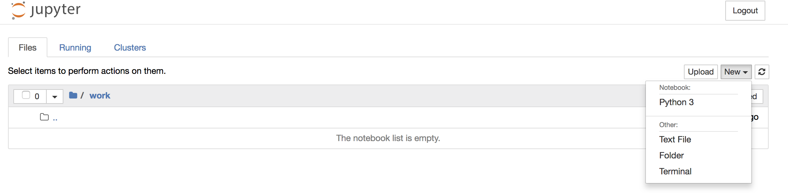

**Advanced Docker**
-------------------

Now that we are relatively comfortable with Docker basics, lets look at some of the advanced Docker topics such as porting the Docker image to repositories (public and private), managing data in containers and finally deploy containers into cloud and other infrastructures etc.,

1. Docker registries
====================

To demonstrate the portability of what we just created, let’s upload our built Docker image and run it somewhere else (Atmosphere cloud). After all, you’ll need to learn how to push to registries when you want to deploy containers to production.

.. important::

	So what exactly is a registry?

	A registry is a collection of repositories, and a repository is a collection of images—sort of like a GitHub repository, except the code is already built. An account on a registry can create many repositories. The docker CLI uses Docker’s public registry by default. You can even set up your own private registry using Docker Trusted Registry

There are several things you can do with Docker registries:

- Pushing images 
- Finding images
- Pulling images
- Sharing images

1.1 Public repositories 
~~~~~~~~~~~~~~~~~~~~~~~

Some example of public registries include `Docker cloud <https://cloud.docker.com/>`_, `Docker hub <https://hub.docker.com/>`_ and `quay.io <https://quay.io/>`_.

1.1.1 Log in with your Docker ID
^^^^^^^^^^^^^^^^^^^^^^^^^^^^^^^^

Now that you've created and tested your image, you can push it to Docker cloud or Docker hub.

.. Note::

	If you don’t have a Docker account, sign up for one at `Docker cloud <https://cloud.docker.com/>`_ or `Docker hub <https://hub.docker.com/>`_. Make note of your username. There are several advantages of registering to Dockerhub which we will see later on in the session

First you have to login to your Docker hub account. To do that:

.. code-block:: bash

	$ docker login
	Login with your Docker ID to push and pull images from Docker Hub. If you don't have a Docker ID, head over to https://hub.docker.com to create one.
	Username (upendradevisetty):                 
	Password:

Enter Username and Password when prompted.

1.1.2 Tag the image
^^^^^^^^^^^^^^^^^^^

The notation for associating a local image with a repository on a registry is ``username/repository:tag``. The tag is optional, but recommended, since it is the mechanism that registries use to give Docker images a version. Give the repository and tag meaningful names for the context, such as ``get-started:part2``. This will put the image in the ``get-started`` repository and tag it as ``part2``.

.. Note::

	By default the docker image gets a ``latest`` tag if you don't provide one. Thought convenient, it is not recommended for reproducibility purposes.

Now, put it all together to tag the image. Run docker tag image with your username, repository, and tag names so that the image will upload to your desired destination. For our docker image since we already have our Dockerhub username we will just add tag which in this case is ``1.0``

.. code-block:: bash

	$ docker tag $YOUR_DOCKERHUB_USERNAME/myfirstapp $YOUR_DOCKERHUB_USERNAME/myfirstapp:1.0

1.1.3 Publish the image
^^^^^^^^^^^^^^^^^^^^^^^

Upload your tagged image to the Dockerhub repository

.. code-block:: bash

	$ docker push $YOUR_DOCKERHUB_USERNAME/myfirstapp:1.0	

Once complete, the results of this upload are publicly available. If you log in to Docker Hub, you will see the new image there, with its pull command.

|docker_image|

Congrats! You just made your first Docker image and shared it with the world!

1.1.4 Pull and run the image from the remote repository
^^^^^^^^^^^^^^^^^^^^^^^^^^^^^^^^^^^^^^^^^^^^^^^^^^^^^^^

Let's try to run the image from the remote repository on Cloud server by logging into CyVerse Atmosphere, `launching an instance <../atmosphere/boot.html>`_

First install Docker on Atmosphere using from here ``https://docs.docker.com/install/linux/docker-ce/ubuntu`` or alternatively you can use ``ezd`` command which is a short-cut command for installing Docker on Atmosphere

.. code-block:: bash

	$ ezd

Now run the following command to run the docker image from Dockerhub

.. code-block:: bash

	$ sudo docker run -d -p 8888:5000 --name myfirstapp $YOUR_DOCKERHUB_USERNAME/myfirstapp:1.0

.. Note::

	You don't have to run ``docker pull`` since if the image isn’t available locally on the machine, Docker will pull it from the repository.

Head over to ``http://<ipaddress>:8888`` and your app should be live. 

1.2 Private repositories
~~~~~~~~~~~~~~~~~~~~~~~~

In an earlier part, we had looked at the Docker Hub, which is a public registry that is hosted by Docker. While the Dockerhub plays an important role in giving public visibility to your Docker images and for you to utilize quality Docker images put up by others, there is a clear need to setup your own private registry too for your team/organization. For example, CyVerse has it own private registry which will be used to push the Docker images.

1.2.1 Pull down the Registry Image
^^^^^^^^^^^^^^^^^^^^^^^^^^^^^^^^^^

You might have guessed by now that the registry must be available as a Docker image from the Docker Hub and it should be as simple as pulling the image down and running that. You are correct!

A Dockerhub search on the keyword ``registry`` brings up the following image as the top result:

|private_registry|

Run a container from ``registry`` Dockerhub image

.. code-block:: bash

	$ docker run -d -p 5000:5000 --name registry registry:2

Run ``docker ps -l`` to check the recent container from this Docker image

.. code-block:: bash

	$ docker ps -l
	CONTAINER ID        IMAGE               COMMAND                  CREATED             STATUS              PORTS                    NAMES
	6e44a0459373        registry:2          "/entrypoint.sh /e..."   11 seconds ago      Up 10 seconds       0.0.0.0:5000->5000/tcp   registry

1.2.2 Tag the image that you want to push
^^^^^^^^^^^^^^^^^^^^^^^^^^^^^^^^^^^^^^^^^

Next step is to tag your image under the registry namespace and push it there

.. code-block:: bash

	$ REGISTRY=localhost:5000

	$ docker tag $YOUR_DOCKERHUB_USERNAME/myfirstapp:1.0 $REGISTRY/$(whoami)/myfirstapp:1.0

1.2.2 Publish the image into the local registry
^^^^^^^^^^^^^^^^^^^^^^^^^^^^^^^^^^^^^^^^^^^^^^^

Finally push the image to the local registry

.. code-block:: bash

	$ docker push $REGISTRY/$(whoami)/myfirstapp:1.0
	The push refers to a repository [localhost:5000/upendra_35/myfirstapp]
	64436820c85c: Pushed 
	831cff83ec9e: Pushed 
	c3497b2669a8: Pushed 
	1c5b16094682: Pushed 
	c52044a91867: Pushed 
	60ab55d3379d: Pushed 
	1.0: digest: sha256:5095dea8b2cf308c5866ef646a0e84d494a00ff0e9b2c8e8313a176424a230ce size: 1572

1.2.3 Pull and run the image from the local repository
^^^^^^^^^^^^^^^^^^^^^^^^^^^^^^^^^^^^^^^^^^^^^^^^^^^^^^

You can also pull the image from the local repository similar to how you pull it from Dockerhub and run a container from it

.. code-block:: bash

	$ docker run -d -P --name=myfirstapplocal $REGISTRY/$(whoami)/myfirstapp:1.0

2. Automated Docker image building from github
==============================================

An automated build is a Docker image build that is triggered by a code change in a GitHub or Bitbucket repository. By linking a remote code repository to a Dockerhub automated build repository, you can build a new Docker image every time a code change is pushed to your code repository.

A build context is a Dockerfile and any files at a specific location. For an automated build, the build context is a repository containing a Dockerfile.

Automated Builds have several advantages:

- Images built in this way are built exactly as specified.
- The Dockerfile is available to anyone with access to your Docker Hub repository.
- Your repository is kept up-to-date with code changes automatically.
- Automated Builds are supported for both public and private repositories on both GitHub and Bitbucket.

2.1 Prerequisites
~~~~~~~~~~~~~~~~~

To use automated builds, you first must have an account on `Docker Hub <https://hub.docker.com>`_ and on the hosted repository provider (`GitHub <https://github.com/>`_ or `Bitbucket <https://bitbucket.org/>`_). While Dockerhub supports linking both GitHub and Bitbucket repositories, here we will use a GitHub repository. If you don't already have one, make sure you have a GitHub account. A basic account is free

.. Note::

	- If you have previously linked your Github or Bitbucket account, you must have chosen the Public and Private connection type. To view your current connection settings, log in to Docker Hub and choose Profile > Settings > Linked Accounts & Services.

	- Building Windows containers is not supported.

2.2 Link your Docker Hub account to GitHub
~~~~~~~~~~~~~~~~~~~~~~~~~~~~~~~~~~~~~~~~~~

1.	Log into Docker Hub.

2.	Navigate to `Profile > Settings > Linked Accounts & Services <https://hub.docker.com/account/authorized-services/>`_.

3.	Click the ``Link GitHub``.
	The system prompts you to choose between **Public and Private** and **Limited Access**. The **Public** and **Private** connection type is required if you want to use the Automated Builds.

4.	Press ``Select`` under **Public and Private** connection type.
	If you are not logged into GitHub, the system prompts you to enter GitHub credentials before prompting you to grant access. After you grant access to your code repository, the system returns you to Docker Hub and the link is complete.

After you grant access to your code repository, the system returns you to Docker Hub and the link is complete. For example, github linked hosted repository looks like this:

|auto_build-1|

2.3 Create a new automated build
~~~~~~~~~~~~~~~~~~~~~~~~~~~~~~~~~

Automated build repositories rely on the integration with your github code repository to build. 

Let's create an automatic build for our ``flask-app`` using the instructions below:

1. Initialize git repository for the `flask-app` directory

.. code-block:: bash

	$ git init
	Initialized empty Git repository in /Users/upendra_35/Documents/git.repos/flask-app/.git/
	
	$ git status
	On branch master

	Initial commit

	Untracked files:
  	(use "git add <file>..." to include in what will be committed)

		Dockerfile
		app.py
		requirements.txt
		templates/

	nothing added to commit but untracked files present (use "git add" to track) 

	$ git add * && git commit -m"Add files and folders"
	[master (root-commit) cfdf021] Add files and folders
	 4 files changed, 75 insertions(+)
	 create mode 100644 Dockerfile
	 create mode 100644 app.py
	 create mode 100644 requirements.txt
	 create mode 100644 templates/index.html

2. Create a new repository on github by navigating to this url - https://github.com/new

|create_repo|

3. Push the repository to github

|create_repo2|

.. code-block:: bash

	$ git remote add origin https://github.com/upendrak/flask-app.git

	$ git push -u origin master
	Counting objects: 7, done.
	Delta compression using up to 8 threads.
	Compressing objects: 100% (5/5), done.
	Writing objects: 100% (7/7), 1.44 KiB | 0 bytes/s, done.
	Total 7 (delta 0), reused 0 (delta 0)
	To https://github.com/upendrak/flask-app.git
	 * [new branch]      master -> master
	Branch master set up to track remote branch master from origin.

4.	Select ``Create`` > ``Create Automated Build`` from Docker Hub.

- The system prompts you with a list of User/Organizations and code repositories. 

- For now select your GitHub account from the User/Organizations list on the left. The list of repositories change.

- Pick the project to build. In this case ``flask-app``. Type in "Conainer Camp flask-app" in the Short Description box.

- If you have a long list of repos, use the filter box above the list to restrict the list. After you select the project, the system displays the Create Automated Build dialog.

|auto_build-2|

.. Note::

	The dialog assumes some defaults which you can customize. By default, Docker builds images for each branch in your repository. It assumes the Dockerfile lives at the root of your source. When it builds an image, Docker tags it with the branch name.

5.	Customize the automated build by pressing the ``Click here to customize`` behavior link.

|auto_build-2.1|

Specify which code branches or tags to build from. You can build by a code branch or by an image tag. You can enter a specific value or use a regex to select multiple values. To see examples of regex, press the Show More link on the right of the page.

- Enter the ``master`` (default) for the name of the branch.

- Leave the Dockerfile location as is.

- Recall the file is in the root of your code repository.

- Specify ``1.0`` for the Tag Name.

6.	Click ``Create``.

.. important::

	During the build process, Docker copies the contents of your Dockerfile to Docker Hub. The Docker community (for public repositories) or approved team members/orgs (for private repositories) can then view the Dockerfile on your repository page.

	The build process looks for a README.md in the same directory as your Dockerfile. If you have a README.md file in your repository, it is used in the repository as the full description. If you change the full description after a build, it’s overwritten the next time the Automated Build runs. To make changes, modify the README.md in your Git repository.

.. warning:: 

	You can only trigger one build at a time and no more than one every five minutes. If you already have a build pending, or if you recently submitted a build request, Docker ignores new requests.

It can take a few minutes for your automated build job to be created. When the system is finished, it places you in the detail page for your Automated Build repository.

7. Manually Trigger a Build

Before you trigger an automated build by pushing to your GitHub ``flask-app`` repo, you'll trigger a manual build. Triggering a manual build ensures everything is working correctly.

From your automated build page choose ``Build Settings``

|auto_build-5|

Press ``Trigger`` button and finally click ``Save Changes``.

.. Note::

	Docker builds everything listed whenever a push is made to the code repository. If you specify a particular branch or tag, you can manually build that image by pressing the Trigger. If you use a regular expression syntax (regex) to define your build branch or tag, Docker does not give you the option to manually build.

|auto_build-6|

8. Review the build results

The Build Details page shows a log of your build systems:

Navigate to the ``Build Details`` page.

Wait until your image build is done.

You may have to manually refresh the page and your build may take several minutes to complete.

|auto_build-7|

Exercise 1 (5-10 mins): Updating and automated building
~~~~~~~~~~~~~~~~~~~~~~~~~~~~~~~~~~~~~~~~~~~~~~~~~~~~~~~

- Add some more cat pics to the `app.py` file
- Add, Commit and Push it to your github repo
- Trigger automatic build with a new tag (2.0) on Dockerhub
- Run an instance to make sure the new pics show up
- Share your Dockerhub link url on Slack

3. Managing data in Docker
==========================

It is possible to store data within the writable layer of a container, but there are some limitations:

- The data doesn’t persist when that container is no longer running, and it can be difficult to get the data out of the container if another process needs it.

- A container’s writable layer is tightly coupled to the host machine where the container is running. You can’t easily move the data somewhere else.

Docker offers three different ways to mount data into a container from the Docker host: **volumes**, **bind mounts**, or **tmpfs volumes**. When in doubt, volumes are almost always the right choice.

3.1 Volumes 
~~~~~~~~~~~

**Volumes** are created and managed by Docker. You can create a volume explicitly using the ``docker volume create`` command, or Docker can create a volume during container creation. When you create a volume, it is stored within a directory on the Docker host (``/var/lib/docker/`` on Linux and check for the location on mac in here https://timonweb.com/posts/getting-path-and-accessing-persistent-volumes-in-docker-for-mac/). When you mount the volume into a container, this directory is what is mounted into the container. A given volume can be mounted into multiple containers simultaneously. When no running container is using a volume, the volume is still available to Docker and is not removed automatically. You can remove unused volumes using ``docker volume prune`` command. 

|volumes|

Volumes are often a better choice than persisting data in a container’s writable layer, because using a volume does not increase the size of containers using it, and the volume’s contents exist outside the lifecycle of a given container. While bind mounts (which we will see later) are dependent on the directory structure of the host machine, volumes are completely managed by Docker. Volumes have several advantages over bind mounts:

- Volumes are easier to back up or migrate than bind mounts.
- You can manage volumes using Docker CLI commands or the Docker API.
- Volumes work on both Linux and Windows containers.
- Volumes can be more safely shared among multiple containers.
- A new volume’s contents can be pre-populated by a container.

.. Note::

	If your container generates non-persistent state data, consider using a ``tmpfs`` mount to avoid storing the data anywhere permanently, and to increase the container’s performance by avoiding writing into the container’s writable layer.

3.1.1 Choose the -v or –mount flag for mounting volumes
^^^^^^^^^^^^^^^^^^^^^^^^^^^^^^^^^^^^^^^^^^^^^^^^^^^^^^^

Originally, the ``-v`` or ``--volume`` flag was used for standalone containers and the ``--mount`` flag was used for swarm services. However, starting with Docker 17.06, you can also use ``--mount`` with standalone containers. In general, ``--mount`` is more explicit and verbose. The biggest difference is that the ``-v`` syntax combines all the options together in one field, while the ``--mount`` syntax separates them. Here is a comparison of the syntax for each flag.

.. Tip::

 	New users should use the ``--mount`` syntax. Experienced users may be more familiar with the ``-v`` or ``--volume`` syntax, but are encouraged to use ``--mount``, because research has shown it to be easier to use.

``-v`` or ``--volume``: Consists of three fields, separated by colon characters (:). The fields must be in the correct order, and the meaning of each field is not immediately obvious.
- In the case of named volumes, the first field is the name of the volume, and is unique on a given host machine.
- The second field is the path where the file or directory are mounted in the container.
- The third field is optional, and is a comma-separated list of options, such as ``ro``.

``--mount``: Consists of multiple key-value pairs, separated by commas and each consisting of a ``<key>=<value>`` tuple. The ``--mount`` syntax is more verbose than ``-v`` or ``--volume``, but the order of the keys is not significant, and the value of the flag is easier to understand.
- The type of the mount, which can be **bind**, **volume**, or **tmpfs**.
- The source of the mount. For named volumes, this is the name of the volume. For anonymous volumes, this field is omitted. May be specified as **source** or **src**.
- The destination takes as its value the path where the file or directory is mounted in the container. May be specified as **destination**, **dst**, or **target**.
- The readonly option, if present, causes the bind mount to be mounted into the container as read-only.

.. Note::

	The ``--mount`` and ``-v`` examples have the same end result.

3.1.2. Create and manage volumes
^^^^^^^^^^^^^^^^^^^^^^^^^^^^^^^^

Unlike a bind mount, you can create and manage volumes outside the scope of any container.

Let's create a volume

.. code-block:: bash

	$ docker volume create my-vol

List volumes:

.. code-block:: bash

	$ docker volume ls

	local               my-vol

Inspect a volume by looking at the Mount section in the `docker volume inspect`

.. code-block:: bash

	$ docker volume inspect my-vol
	[
	    {
	        "Driver": "local",
	        "Labels": {},
	        "Mountpoint": "/var/lib/docker/volumes/my-vol/_data",
	        "Name": "my-vol",
	        "Options": {},
	        "Scope": "local"
	    }
	]

Remove a volume

.. code-block:: bash

	$ docker volume rm my-vol

3.1.3 Populate a volume using a container
^^^^^^^^^^^^^^^^^^^^^^^^^^^^^^^^^^^^^^^^^

This example starts an ``nginx`` container and populates the new volume ``nginx-vol`` with the contents of the container’s ``/var/log/nginx`` directory, which is where Nginx stores its log files.

.. code-block:: bash

	$ docker run -d -p 8891:80 --name=nginxtest --mount source=nginx-vol,target=/var/log/nginx nginx:latest

So, we now have a copy of Nginx running inside a Docker container on our machine, and our host machine's port 5000 maps directly to that copy of Nginx's port 80. Let's use curl to do a quick test request:

.. code-block:: bash

	$ curl localhost:8891
	<!DOCTYPE html>
	<html>
	<head>
	<title>Welcome to nginx!</title>
	
	</head>
	<body>
	<h1>Welcome to nginx!</h1>
	
If you see this page, the nginx web server is successfully installed and
	working. Further configuration is required.

	
For online documentation and support please refer to
	<a href="http://nginx.org/">nginx.org</a>. 
	Commercial support is available at
	<a href="http://nginx.com/">nginx.com</a>.

	
<em>Thank you for using nginx.</em>

	</body>
	</html>

You'll get a screenful of HTML back from Nginx showing that Nginx is up and running. But more interestingly, if you look in the ``nginx-vol`` volume on the host machine and take a look at the ``access.log`` file you'll see a log message from Nginx showing our request.

.. code-block:: bash
	
	cat nginx-vol/_data/access.log

Use ``docker inspect nginx-vol`` to verify that the volume was created and mounted correctly. Look for the Mounts section:

.. code-block:: bash

	"Mounts": [
	            {
	                "Type": "volume",
	                "Name": "nginx-vol",
	                "Source": "/var/lib/docker/volumes/nginx-vol/_data",
	                "Destination": "/var/log/nginx",
	                "Driver": "local",
	                "Mode": "z",
	                "RW": true,
	                "Propagation": ""
	            }
	        ],

This shows that the mount is a volume, it shows the correct source and destination, and that the mount is read-write.

After running either of these examples, run the following commands to clean up the containers and volumes.

.. code-block:: bash

	$ docker stop nginxtest

	$ docker rm nginxtest

	$ docker volume rm nginx-vol

3.2 Bind mounts
~~~~~~~~~~~~~~~

**Bind mounts:** When you use a bind mount, a file or directory on the host machine is mounted into a container. 

.. tip::

	If you are developing new Docker applications, consider using named **volumes** instead. You can’t use Docker CLI commands to directly manage bind mounts.

|bind_mount|

.. Warning:: 

	One side effect of using bind mounts, for better or for worse, is that you can change the host filesystem via processes running in a container, including creating, modifying, or deleting important system files or directories. This is a powerful ability which can have security implications, including impacting non-Docker processes on the host system.

	If you use ``--mount`` to bind-mount a file or directory that does not yet exist on the Docker host, Docker does not automatically create it for you, but generates an error.

3.2.1 Start a container with a bind mount
^^^^^^^^^^^^^^^^^^^^^^^^^^^^^^^^^^^^^^^^^

.. code-block:: bash

	$ mkdir data

	$ docker run -d -p 8891:80 --name devtest --mount type=bind,source="$(pwd)"/data,target=/var/log/nginx nginx:latest

Use `docker inspect devtest` to verify that the bind mount was created correctly. Look for the "Mounts" section

.. code-block::

	$ docker inspect devtest

	"Mounts": [
	            {
	                "Type": "bind",
	                "Source": "/Users/upendra_35/Documents/git.repos/flask-app/data",
	                "Destination": "/var/log/nginx",
	                "Mode": "",
	                "RW": true,
	                "Propagation": "rprivate"
	            }
	        ],

This shows that the mount is a bind mount, it shows the correct source and target, it shows that the mount is read-write, and that the propagation is set to rprivate.

Stop the container:

.. code-block:: bash

	$ docker rm -f devtest

3.2.2 Use a read-only bind mount
^^^^^^^^^^^^^^^^^^^^^^^^^^^^^^^^

For some development applications, the container needs to write into the bind mount, so changes are propagated back to the Docker host. At other times, the container only needs read access.

This example modifies the one above but mounts the directory as a read-only bind mount, by adding ``ro`` to the (empty by default) list of options, after the mount point within the container. Where multiple options are present, separate them by commas.

.. code-block:: bash

	$ docker run -d -p 8891:80 --name devtest --mount type=bind,source="$(pwd)"/data,target=/var/log/nginx,readonly nginx:latest

Use ``docker inspect devtest`` to verify that the bind mount was created correctly. Look for the Mounts section:

.. code-block:: bash

	"Mounts": [
            {
                "Type": "bind",
                "Source": "/Users/upendra_35/Documents/git.repos/flask-app/data",
                "Destination": "/var/log/nginx",
                "Mode": "",
                "RW": false,
                "Propagation": "rprivate"
            }
        ],
Stop the container:

.. code-block:: bash

	$ docker rm -f devtest

Remove the volume:

.. code-block:: bash

	$ docker volume rm devtest

3.3 tmpfs
~~~~~~~~~

**tmpfs mounts:** A tmpfs mount is not persisted on disk, either on the Docker host or within a container. It can be used by a container during the lifetime of the container, to store non-persistent state or sensitive information. For instance, internally, swarm services use tmpfs mounts to mount secrets into a service’s containers.

|tmpfs|

**Volumes** and **bind mounts** are mounted into the container’s filesystem by default, and their contents are stored on the host machine. There may be cases where you do not want to store a container’s data on the host machine, but you also don’t want to write the data into the container’s writable layer, for performance or security reasons, or if the data relates to non-persistent application state. An example might be a temporary one-time password that the container’s application creates and uses as-needed. To give the container access to the data without writing it anywhere permanently, you can use a tmpfs mount, which is only stored in the host machine’s memory (or swap, if memory is low). When the container stops, the tmpfs mount is removed. If a container is committed, the tmpfs mount is not saved.

.. code-block:: bash

	$ docker run -d -p 8891:80 --name devtest --mount type=tmpfs,target=/var/log/nginx nginx:latest

Use `docker inspect devtest` to verify that the bind mount was created correctly. Look for the Mounts section:

.. code-block:: bash

	$ docker inspect devtest

	"Mounts": [
	            {
	                "Type": "tmpfs",
	                "Source": "",
	                "Destination": "/var/log/nginx",
	                "Mode": "",
	                "RW": true,
	                "Propagation": ""
	            }
	        ],

You can see from the above output that the ``Source`` filed is empty which indicates that the contents are not avaible on Docker host or host file system. 

Stop the container:

.. code-block:: bash

	$ docker rm -f devtest

Remove the volume:

.. code-block:: bash

	$ docker volume rm devtest

4. Docker Compose for multi container apps
==========================================

**Docker Compose** is a tool for defining and running your multi-container Docker applications. 

Main advantages of Docker compose include:

- Your applications can be defined in a YAML file where all the options that you used in ``docker run`` are now defined (Reproducibility).
- It allows you to manage your application as a single entity rather than dealing with individual containers (Simplicity).

Let's now create a simple web app with Docker Compose using Flask (which you already seen before) and Redis. We will end up with a Flask container and a Redis container all on one host.

.. Note::

	The code for the above compose example is available `here <https://github.com/upendrak/compose_flask>`_

1. You’ll need a directory for your project on your host machine:

.. code-block:: bash

	$ mkdir compose_flask && cd compose_flask

2. Add the following to `requirements.txt` inside `compose_flask` directory:

.. code-block:: bash

	flask
	redis

3. Copy and paste the following code into a new file called `app.py` inside `compose_flask` directory:

.. code-block:: bash

	from flask import Flask
	from redis import Redis

	app = Flask(__name__)
	redis = Redis(host='redis', port=6379)

	@app.route('/')
	def hello():
	    redis.incr('hits')
	    return 'This Compose/Flask demo has been viewed %s time(s).' % redis.get('hits')

	if __name__ == "__main__":
	    app.run(host="0.0.0.0", debug=True)

4. Create a Dockerfile with the following code inside ``compose_flask`` directory:

.. code-block:: bash

	FROM python:2.7
	ADD . /code
	WORKDIR /code
	RUN pip install -r requirements.txt
	CMD python app.py

5. Add the following code to a new file, ``docker-compose.yml``, in your project directory:

.. code-block:: bash

	version: '2'
	services:
	    web:
	        restart: always
	        build: .
	        ports:
	            - "8888:5000"
	        volumes:
	            - .:/code
	        depends_on:
	            - redis
	    redis:
	        restart: always
	        image: redis

A brief explanation of ``docker-compose.yml`` is as below:

- ``restart: always`` means that it will restart whenever it fails.
- We define two services, **web** and **redis**.
- The web service builds from the Dockerfile in the current directory.
- Forwards the container’s exposed port (5000) to port 8888 on the host.
- Mounts the project directory on the host to /code inside the container (allowing you to modify the code without having to rebuild the image).
- ``depends_on`` links the web service to the Redis service.
- The redis service uses the latest Redis image from Docker Hub.

.. Note::

	Docker for Mac and Docker Toolbox already include Compose along with other Docker apps, so Mac users do not need to install Compose separately.
	Docker for Windows and Docker Toolbox already include Compose along with other Docker apps, so most Windows users do not need to install Compose separately.

	For Linux users 

	.. code-block:: bash

		sudo curl -L https://github.com/docker/compose/releases/download/1.19.0/docker-compose-`uname -s`-`uname -m` -o /usr/local/bin/docker-compose

		sudo chmod +x /usr/local/bin/docker-compose

5. Build and Run with ``docker-compose up -d`` command

.. code-block:: bash

	$ docker-compose up -d

	Building web
	Step 1/5 : FROM python:2.7
	2.7: Pulling from library/python
	f49cf87b52c1: Already exists
	7b491c575b06: Already exists
	b313b08bab3b: Already exists
	51d6678c3f0e: Already exists
	09f35bd58db2: Already exists
	f7e0c30e74c6: Pull complete
	c308c099d654: Pull complete
	339478b61728: Pull complete
	Digest: sha256:8cb593cb9cd1834429f0b4953a25617a8457e2c79b3e111c0f70bffd21acc467
	Status: Downloaded newer image for python:2.7
	 ---> 9e92c8430ba0
	Step 2/5 : ADD . /code
	 ---> 746bcecfc3c9
	Step 3/5 : WORKDIR /code
	 ---> c4cf3d6cb147
	Removing intermediate container 84d850371a36
	Step 4/5 : RUN pip install -r requirements.txt
	 ---> Running in d74c2e1cfbf7
	Collecting flask (from -r requirements.txt (line 1))
	  Downloading Flask-0.12.2-py2.py3-none-any.whl (83kB)
	Collecting redis (from -r requirements.txt (line 2))
	  Downloading redis-2.10.6-py2.py3-none-any.whl (64kB)
	Collecting itsdangerous>=0.21 (from flask->-r requirements.txt (line 1))
	  Downloading itsdangerous-0.24.tar.gz (46kB)
	Collecting Jinja2>=2.4 (from flask->-r requirements.txt (line 1))
	  Downloading Jinja2-2.10-py2.py3-none-any.whl (126kB)
	Collecting Werkzeug>=0.7 (from flask->-r requirements.txt (line 1))
	  Downloading Werkzeug-0.14.1-py2.py3-none-any.whl (322kB)
	Collecting click>=2.0 (from flask->-r requirements.txt (line 1))
	  Downloading click-6.7-py2.py3-none-any.whl (71kB)
	Collecting MarkupSafe>=0.23 (from Jinja2>=2.4->flask->-r requirements.txt (line 1))
	  Downloading MarkupSafe-1.0.tar.gz
	Building wheels for collected packages: itsdangerous, MarkupSafe
	  Running setup.py bdist_wheel for itsdangerous: started
	  Running setup.py bdist_wheel for itsdangerous: finished with status 'done'
	  Stored in directory: /root/.cache/pip/wheels/fc/a8/66/24d655233c757e178d45dea2de22a04c6d92766abfb741129a
	  Running setup.py bdist_wheel for MarkupSafe: started
	  Running setup.py bdist_wheel for MarkupSafe: finished with status 'done'
	  Stored in directory: /root/.cache/pip/wheels/88/a7/30/e39a54a87bcbe25308fa3ca64e8ddc75d9b3e5afa21ee32d57
	Successfully built itsdangerous MarkupSafe
	Installing collected packages: itsdangerous, MarkupSafe, Jinja2, Werkzeug, click, flask, redis
	Successfully installed Jinja2-2.10 MarkupSafe-1.0 Werkzeug-0.14.1 click-6.7 flask-0.12.2 itsdangerous-0.24 redis-2.10.6
	 ---> 5cc574ff32ed
	Removing intermediate container d74c2e1cfbf7
	Step 5/5 : CMD python app.py
	 ---> Running in 3ddb7040e8be
	 ---> e911b8e8979f
	Removing intermediate container 3ddb7040e8be
	Successfully built e911b8e8979f
	Successfully tagged composeflask_web:latest

And that’s it! You should be able to see the Flask application running on ``http://localhost:8888`` or ``<ipaddress>:8888``

|docker-compose|

Exercise 2 (10 mins)
~~~~~~~~~~~~~~~~~~~~

- Change the greeting in ``app.py`` and save it. For example, change the ``This Compose/Flask demo has been viewed`` message to ``This Container Camp Workshop demo has been viewed``
- Refresh the `app` in your browser. What do you see now?
- Create a automatic build for ``compose-flask`` project directory
- Share your Dockerhub link url on Slack

5. Improving your data science workflow using Docker containers (Containerized Data Science)
============================================================================================

For a data scientist, running a container that is already equipped with the libraries and tools needed for a particular analysis eliminates the need to spend hours debugging packages across different environments or configuring custom environments.

But why Set Up a Data Science Environment in a Container?

- One reason is speed. We want data scientists using our platform to launch a Jupyter or RStudio session in minutes, not hours. We also want them to have that fast user experience while still working in a governed, central architecture (rather than on their local machines). 

- Containerization benefits both data science and IT/technical operations teams. In the DataScience.com Platform, for instance, we allow IT to configure environments with different languages, libraries, and settings in an admin dashboard and make those images available in the dropdown menu when a data scientist launches a session. These environments can be selected for any run, session, scheduled job, or API. (Or you don’t have to configure anything at all. We provide plenty of standard environment templates to choose from.)

- Ultimately, containers solve a lot of common problems associated with doing data science work at the enterprise level. They take the pressure off of IT to produce custom environments for every analysis, standardize how data scientists work, and ensure that old code doesn’t stop running because of environment changes. To start using containers and our library of curated images to do collaborative data science work, request a demo of our platform today.

- Configuring a data science environment can be a pain. Dealing with inconsistent package versions, having to dive through obscure error messages, and having to wait hours for packages to compile can be frustrating. This makes it hard to get started with data science in the first place, and is a completely arbitrary barrier to entry.

Thanks to the rich ecosystem, there are already several readily available images for the common components in data science pipelines. Here are some Docker images to help you quickly spin up your own data science pipeline:

- `MySQL <https://hub.docker.com/_/mysql/>`_
- `Postgres <https://hub.docker.com/_/postgres/>`_
- `Redmine <https://hub.docker.com/_/redmine/>`_
- `MongoDB <https://hub.docker.com/_/mongo/>`_
- `Hadoop <https://hub.docker.com/r/sequenceiq/hadoop-docker/>`_
- `Spark <https://hub.docker.com/r/sequenceiq/spark/>`_
- `Zookeeper <https://hub.docker.com/r/wurstmeister/zookeeper/>`_
- `Kafka <https://github.com/spotify/docker-kafka>`_
- `Cassandra <https://hub.docker.com/_/cassandra/>`_
- `Storm <https://github.com/wurstmeister/storm-docker>`_
- `Flink <https://github.com/apache/flink/tree/master/flink-contrib/docker-flink>`_
- `R <https://github.com/rocker-org/rocker>`_

Motivation: Say you want to play around with some cool data science libraries in Python or R but what you don’t want to do is spend hours on installing Python or R, working out what libraries you need, installing each and every one and then messing around with the tedium of getting things to work just right on your version of Linux/Windows/OSX/OS9 — well this is where Docker comes to the rescue! With Docker we can get a Jupyter ‘Data Science’ notebook stack up and running in no time at all. Let’s get started! We will see few examples of thse in the following sections...

.. Note::

	The above code can be found in this `github <https://github.com/upendrak/jupyternotebook_docker>`_

1. Launch a Jupyter notebook conatiner

Docker allows us to run a ‘ready to go’ Jupyter data science stack in what’s known as a container:

1.1 Create a `docker-compose.yml` file

.. code-block:: bash

	$ mkdir jn && cd jn

.. code-block:: bash
	
	version: '2'

	services:
	  datascience-notebook:
	    image: jupyter/datascience-notebook
	    volumes:
	      - .:/data
	    ports:
	      - 8888:8888
	    container_name:   datascience-notebook-container

.. Note::

	The ``jupyter/datascience-notebook`` image can be found on dockerhub

|jn_ss|

1.2 Run container using docker-compose file

.. code-block:: bash

	$ docker-compose up
	Creating datascience-notebook-container ... 
	Creating datascience-notebook-container ... done
	Attaching to datascience-notebook-container
	datascience-notebook-container | Execute the command: jupyter notebook
	datascience-notebook-container | [I 08:44:31.312 NotebookApp] Writing notebook server cookie secret to /home/jovyan/.local/share/jupyter/runtime/notebook_cookie_secret
	datascience-notebook-container | [W 08:44:31.332 NotebookApp] WARNING: The notebook server is listening on all IP addresses and not using encryption. This is not 	recommended.
	datascience-notebook-container | [I 08:44:31.370 NotebookApp] JupyterLab alpha preview extension loaded from /opt/conda/lib/python3.6/site-packages/jupyterlab
	datascience-notebook-container | JupyterLab v0.27.0
	datascience-notebook-container | Known labextensions:
	datascience-notebook-container | [I 08:44:31.373 NotebookApp] Running the core application with no additional extensions or settings
	datascience-notebook-container | [I 08:44:31.379 NotebookApp] Serving notebooks from local directory: /home/jovyan
	datascience-notebook-container | [I 08:44:31.379 NotebookApp] 0 active kernels 
	datascience-notebook-container | [I 08:44:31.379 NotebookApp] The Jupyter Notebook is running at: http://[all ip addresses on your 	system]:8888/?token=dfb50de6c1da091fd62336ac52cdb88de5fe339eb0faf478
	datascience-notebook-container | [I 08:44:31.379 NotebookApp] Use Control-C to stop this server and shut down all kernels (twice to skip confirmation).
	datascience-notebook-container | [C 08:44:31.380 NotebookApp] 
	datascience-notebook-container |     
	datascience-notebook-container |     Copy/paste this URL into your browser when you connect for the first time,
	datascience-notebook-container |     to login with a token:
	datascience-notebook-container |         http://localhost:8888/?token=dfb50de6c1da091fd62336ac52cdb88de5fe339eb0faf478

The last line is a URL that we need to copy and paste into our browser to access our new Jupyter stack:

.. code-block:: bash

	http://localhost:8888/?token=dfb50de6c1da091fd62336ac52cdb88de5fe339eb0faf478

.. warning::

	Do not copy and paste the above URL in your browser as this URL is specific to my environment.

Once you’ve done that you should be greeted by your very own containerised Jupyter service!

|jn_login|

To create your first notebook, drill into the work directory and then click on the ‘New’ button on the right hand side and choose ‘Python 3’ to create a new Python 3 based Notebook. 

|jn_login2|

Now you can write your python code. Here is an example

|jn_login3|

|jn_login3.5|

To shut down the container once you’re done working, simply hit Ctrl-C in the terminal/command prompt. Your work will all be saved on your actual machine in the path we set in our Docker compose file. And there you have it — a quick and easy way to start using Jupyter notebooks with the magic of Docker.

2. Launch a R-Studio container

Next, we will see a Docker image from Rocker which will allow us to run RStudio inside the container and has many useful R packages already installed.

|rstudio_ss|

.. code-block:: bash

	$ docker run --rm -d -p 8787:8787 rocker/rstudio:3.4.3

.. Note:: 
	
	 ``–rm`` ensures that when we quit the container, the container is deleted. If we did not do this, everytime we run a container, a version of it will be saved to our local computer. This can lead to the eventual wastage of a lot of disk space until we manually remove these containers. 

The command above will lead RStudio-Server to launch invisibly. To connect to it, open a browser and enter http://localhost:8787, or <ipaddress>:8787 on cloud 

|rstudio_login2|

Enter ``rstudio`` as username and password. Finally Rstudio shows up and you can run your R command from here

|rstudio_login|

3. Machine learning using Docker

In this simple example we’ll take a sample dataset of fruits metrics (like size, weight, texture) labelled apples and oranges. Then we can predict the fruit given a new set of fruit metrics using scikit-learn’s decision tree

You can find the above code in this `github repo <https://github.com/upendrak/scikit_tree_docker>`_ 

1. Create a directory that consists of all the files

.. code-block:: bash

	$ mkdir scikit_docker && cd scikit_docker

2. Create ``requirements.txt`` file — Contains python modules and has nothing to do with Docker inside the folder - ``scikit_docker``.

.. code-block:: bash

	numpy
	scipy
	scikit-learn

3. Create a file called ``app.py`` inside the folder — ``scikit_docker``

.. code-block:: bash

	from sklearn import tree
	#DataSet
	#[size,weight,texture]
	X = [[181, 80, 44], [177, 70, 43], [160, 60, 38], [154, 54, 37],[166, 65, 40], [190, 90, 47], [175, 64, 39], [177, 70, 40], [159, 55, 37], [171, 75, 42], [181, 85, 43]]

	Y = ['apple', 'apple', 'orange', 'orange', 'apple', 'apple', 'orange', 'orange', 'orange', 'apple', 'apple']

	#classifier - DecisionTreeClassifier
	clf_tree = tree.DecisionTreeClassifier();
	clf_tree = clf_tree.fit(X,Y);

	#test_data
	test_data = [[190,70,42],[172,64,39],[182,80,42]];

	#prediction
	prediction_tree = clf_tree.predict(test_data);

	# Write output to a file
	with open("output.txt", 'w') as fh_out:
		fh_out.write("Prediction of DecisionTreeClassifier:")
		fh_out.write(str(prediction_tree))

4. Create a Dockerfile that contains all the instructions for building a Docker image inside the project directory

.. code-block:: bash

	# Use an official Python runtime as a parent image
	FROM python:3.6-slim
	MAINTAINER Upendra Devisetty <upendra@cyverse.org>
	LABEL Description "This Dockerfile is used to build a scikit-learn’s decision tree image"

	# Set the working directory to /app
	WORKDIR /app

	# Copy the current directory contents into the container at /app
	ADD . /app

	# Install any needed packages specified in requirements.txt
	RUN pip install -r requirements.txt

	# Define environment variable
	ENV NAME World

	# Run app.py when the container launches
	CMD ["python", "app.py"]

5. Create a Docker compose YAML file

.. code-block:: bash

	version: '2'
	services:
	    datasci:
	        build: .
	        volumes:
	            - .:/app

5. Now Build and Run the Docker image using `docker-compose up` command to predict the fruit given a new set of fruit metrics

.. code-block:: bash

	$ docker-compose up 
	Building datasci
	Step 1/8 : FROM python:3.6-slim
	 ---> dc41c0491c65
	Step 2/8 : MAINTAINER Upendra Devisetty <upendra@cyverse.org>
	 ---> Running in 95a4da823100
	 ---> 7c4d5b78bb0a
	Removing intermediate container 95a4da823100
	Step 3/8 : LABEL Description "This Dockerfile is used to build a scikit-learn’s decision tree image"
	 ---> Running in e8000ae57a7d
	 ---> d872e29971e3
	Removing intermediate container e8000ae57a7d
	Step 4/8 : WORKDIR /app
	 ---> 083eb3e4fb16
	Removing intermediate container c965871286f9
	Step 5/8 : ADD . /app
	 ---> 82b1dbdbe759
	Step 6/8 : RUN pip install -r requirements.txt
	 ---> Running in 3c82f7d5dd95
	Collecting numpy (from -r requirements.txt (line 1))
	  Downloading numpy-1.14.0-cp36-cp36m-manylinux1_x86_64.whl (17.2MB)
	Collecting scipy (from -r requirements.txt (line 2))
	  Downloading scipy-1.0.0-cp36-cp36m-manylinux1_x86_64.whl (50.0MB)
	Collecting scikit-learn (from -r requirements.txt (line 3))
	  Downloading scikit_learn-0.19.1-cp36-cp36m-manylinux1_x86_64.whl (12.4MB)
	Installing collected packages: numpy, scipy, scikit-learn
	Successfully installed numpy-1.14.0 scikit-learn-0.19.1 scipy-1.0.0
	 ---> 3d402c23203f
	Removing intermediate container 3c82f7d5dd95
	Step 7/8 : ENV NAME World
	 ---> Running in d0468b521e81
	 ---> 9cd31e8e7c95
	Removing intermediate container d0468b521e81
	Step 8/8 : CMD python app.py
	 ---> Running in 051bd2235697
	 ---> 36bb4c3d9183
	Removing intermediate container 051bd2235697
	Successfully built 36bb4c3d9183
	Successfully tagged scikitdocker_datasci:latest
	WARNING: Image for service datasci was built because it did not already exist. To rebuild this image you must use `docker-compose build` or `docker-compose up --build`.
	Creating scikitdocker_datasci_1 ... 
	Creating scikitdocker_datasci_1 ... done
	Attaching to scikitdocker_datasci_1
	scikitdocker_datasci_1 exited with code 0

Use ``docker-compose rm`` to remove the container after docker-compose finish running

.. code-block:: bash

	docker-compose rm 
	Going to remove scikitdocker_datasci_1
	Are you sure? [yN] y
	Removing scikitdocker_datasci_1 ... done

You will find the ouput file in the ``scikit_docker`` folder with the following contents

.. code-block:: bash

	$ cat output.txt 
	Prediction of DecisionTreeClassifier:['apple' 'orange' 'apple']

.. |private_registry| image:: ../img/private_registry.png
  :width: 750
  :height: 700 

.. |create_repo| image:: ../img/create_repo.png
  :width: 750
  :height: 700 

.. |auto_build-1| image:: ../img/auto_build-1.png
  :width: 750
  :height: 700 

.. |auto_build-2| image:: ../img/auto_build-2.png
  :width: 750
  :height: 700 

.. |auto_build-2.1| image:: ../img/auto_build-2.1.png
  :width: 750
  :height: 700 

.. |auto_build-5| image:: ../img/auto_build-5.png
  :width: 750
  :height: 700 

.. |auto_build-6| image:: ../img/auto_build-6.png
  :width: 750
  :height: 700 

.. |volumes| image:: ../img/volumes.png
  :width: 750
  :height: 700 

.. |bind_mount| image:: ../img/bind_mount.png
  :width: 750
  :height: 700 

.. |tmpfs| image:: ../img/tmpfs.png
  :width: 750
  :height: 700 

.. |docker-compose| image:: ../img/dc-1.png
  :width: 750
  :height: 700 

.. |jn_login| image:: ../img/jn_login.png
  :width: 750
  :height: 700 

.. |jn_login3.5| image:: ../img/jn_login3.5.png
  :width: 750
  :height: 700 

.. |jn_login3| image:: ../img/jn_login3.png
  :width: 750
  :height: 700 

.. |rstudio_ss| image:: ../img/rstudio_ss.png
  :width: 750
  :height: 700 

.. |rstudio_login2| image:: ../img/rstudio_login2.png
  :width: 750
  :height: 700 

.. |rstudio_login| image:: ../img/rstudio_login.png
  :width: 750
  :height: 700 
