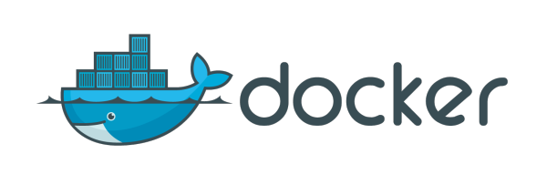
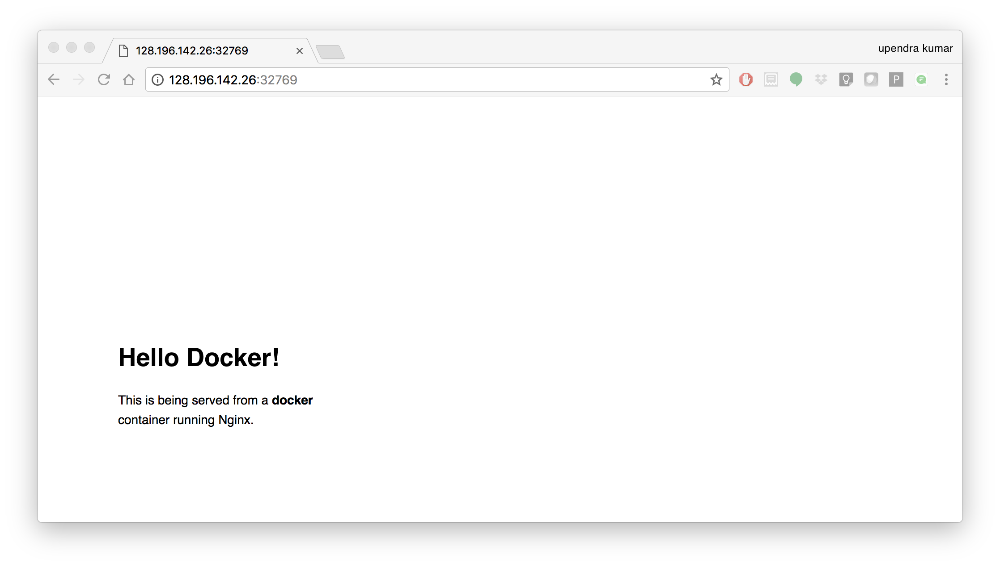
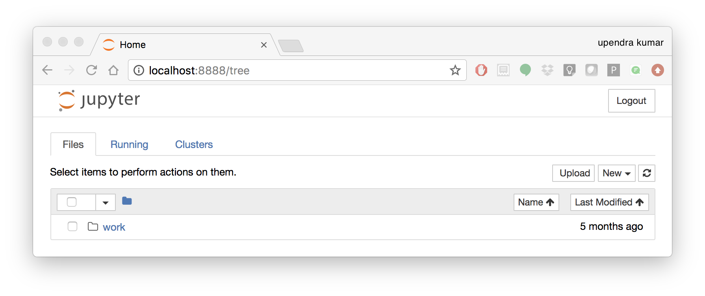

**Introduction to Docker**
--------------------------

1. Prerequisites
================

There are no specific skills needed for this tutorial beyond a basic comfort with the command line and using a text editor. Prior experience in developing web applications will be helpful but is not required.

2. Docker Installation
======================

Getting all the tooling setup on your computer can be a daunting task, but not with Docker. Getting Docker up and running on your favorite OS (Mac/Windows/Linux) is very easy.

The getting started guide on Docker has detailed instructions for setting up Docker on `Mac <https://docs.docker.com/docker-for-mac/install/>`_/`Windows <https://docs.docker.com/docker-for-windows/install/>`_/`Linux <https://docs.docker.com/install/linux/docker-ce/ubuntu/>`_.

.. Note::

	If you're using Docker for Windows make sure you have `shared your drive <https://docs.docker.com/docker-for-windows/#shared-drives>`_.

	If you're using an older version of Windows or MacOS you may need to use `Docker Machine <https://docs.docker.com/machine/overview/>`_ instead.

	All commands work in either bash or Powershell on Windows.

.. Note::

	Depending on how you've installed Docker on your system, you might see a ``permission denied`` error after running the above command. If you're on Linux, you may need to prefix your Docker commands with sudo. Alternatively to run docker command without sudo, you need to add your user (who has root privileges) to docker group.
	For this run:

	Create the docker group::

		$ sudo groupadd docker

	Add your user to the docker group::

		$ sudo usermod -aG docker $USER

	Log out and log back in so that your group membership is re-evaluated

Once you are done installing Docker, test your Docker installation by running the following command to make sure you are using version 1.13 or higher:

.. code-block:: bash

	$ docker --version
	Docker version 17.09.0-ce, build afdb6d4

When run without ``--version`` you should see a whole bunch of lines showing the different options available with ``docker``. Alternatively you can test your installation by running the following:

.. code-block:: bash

	$ docker run hello-world
	Unable to find image 'hello-world:latest' locally
	latest: Pulling from library/hello-world
	03f4658f8b78: Pull complete
	a3ed95caeb02: Pull complete
	Digest: sha256:8be990ef2aeb16dbcb9271ddfe2610fa6658d13f6dfb8bc72074cc1ca36966a7
	Status: Downloaded newer image for hello-world:latest

	Hello from Docker.
	This message shows that your installation appears to be working correctly.

	To generate this message, Docker took the following steps:
	 1. The Docker client contacted the Docker daemon.
	 2. The Docker daemon pulled the "hello-world" image from the Docker Hub.
	 3. The Docker daemon created a new container from that image which runs the
	    executable that produces the output you are currently reading.
	 4. The Docker daemon streamed that output to the Docker client, which sent it
	    to your terminal.
	.......

3. Running Docker containers
============================

Now that you have everything setup, it's time to get our hands dirty. In this section, you are going to run a container from `Alpine Linux <http://www.alpinelinux.org/>`_ (a lightweight linux distribution) image on your system and get a taste of the ``docker run`` command.

But wait, what exactly is a container and image?

**Containers** - Running instances of Docker images — containers run the actual applications. A container includes an application and all of its dependencies. It shares the kernel with other containers, and runs as an isolated process in user space on the host OS.

**Images** - The file system and configuration of our application which are used to create containers. To find out more about a Docker image, run ``docker inspect hello-world``. In the demo above, you could have used the ``docker pull`` command to download the ``hello-world`` image. However when you executed the command ``docker run hello-world``, it also did a ``docker pull`` behind the scenes to download the ``hello-world`` image with ``latest`` tag (we will learn more about tags little later).

Now that we know what a container and image is, let's run the following command in our terminal:

.. code-block:: bash

	$ docker run alpine ls -l
	total 52
	drwxr-xr-x    2 root     root          4096 Dec 26  2016 bin
	drwxr-xr-x    5 root     root           340 Jan 28 09:52 dev
	drwxr-xr-x   14 root     root          4096 Jan 28 09:52 etc
	drwxr-xr-x    2 root     root          4096 Dec 26  2016 home
	drwxr-xr-x    5 root     root          4096 Dec 26  2016 lib
	drwxr-xr-x    5 root     root          4096 Dec 26  2016 media
	........

Similar to ``docker run hello-world`` command in the demo above, ``docker run alpine ls -l`` command fetches the ``alpine:latest`` image from the Docker registry first, saves it in our system and then runs a container from that saved image.

When you run ``docker run alpine``, you provided a command ``ls -l``, so Docker started the command specified and you saw the listing

You can use the ``docker images`` command to see a list of all images on your system

.. code-block:: bash

	$ docker images
	REPOSITORY              TAG                 IMAGE ID            CREATED             VIRTUAL SIZE
	alpine                 	latest              c51f86c28340        4 weeks ago         1.109 MB
	hello-world             latest              690ed74de00f        5 months ago        960 B

Let's try something more exciting.

.. code-block:: bash

	$ docker run alpine echo "Hello world"
	Hello world

OK, that's some actual output. In this case, the Docker client dutifully ran the ``echo`` command in our ``alpine`` container and then exited it. If you've noticed, all of that happened pretty quickly. Imagine booting up a virtual machine, running a command and then killing it. Now you know why they say containers are fast!

Try another command.

.. code-block:: bash

	$ docker run alpine sh

Wait, nothing happened! Is that a bug? Well, no. These interactive shells will exit after running any scripted commands such as ``sh``, unless they are run in an interactive terminal - so for this example to not exit, you need to ``docker run -it alpine sh``. You are now inside the container shell and you can try out a few commands like ``ls -l``, ``uname -a`` and others.

Before doing that, now it's time to see the ``docker ps`` command which shows you all containers that are currently running.

.. code-block:: bash

	$ docker ps
	CONTAINER ID        IMAGE               COMMAND             CREATED             STATUS              PORTS               NAMES

Since no containers are running, you see a blank line. Let's try a more useful variant: ``docker ps -a``

.. code-block:: bash

	$ docker ps -a
	CONTAINER ID        IMAGE               COMMAND                  CREATED             STATUS                      PORTS               NAMES
	36171a5da744        alpine              "/bin/sh"                5 minutes ago       Exited (0) 2 minutes ago                        fervent_newton
	a6a9d46d0b2f        alpine             "echo 'hello from alp"    6 minutes ago       Exited (0) 6 minutes ago                        lonely_kilby
	ff0a5c3750b9        alpine             "ls -l"                   8 minutes ago       Exited (0) 8 minutes ago                        elated_ramanujan
	c317d0a9e3d2        hello-world         "/hello"                 34 seconds ago      Exited (0) 12 minutes ago                       stupefied_mcclintock

What you see above is a list of all containers that you ran. Notice that the STATUS column shows that these containers exited a few minutes ago.

If you want to run scripted commands such as ``sh``, they should be run in an interactive terminal. In addition, interactive terminal allows you to run more than one command in a container. Let's try that now:

.. code-block:: bash

	$ docker run -it alpine sh
	/ # ls
	bin    dev    etc    home   lib    media  mnt    proc   root   run    sbin   srv    sys    tmp    usr    var
	/ # uname -a
	Linux de4bbc3eeaec 4.9.49-moby #1 SMP Wed Sep 27 23:17:17 UTC 2017 x86_64 Linux

Running the ``run`` command with the ``-it`` flags attaches us to an interactive ``tty`` in the container. Now you can run as many commands in the container as you want. Take some time to run your favorite commands.

Exit out of the container by giving the ``exit`` command.

.. code-block:: bash

	/ # exit

.. Note::

	If you type ``exit`` your **container** will exit and is no longer active. To check that, try the following::

		$ docker ps -l
		CONTAINER ID        IMAGE                 COMMAND                  CREATED             STATUS                          PORTS                    NAMES
		de4bbc3eeaec        alpine                "/bin/sh"                3 minutes ago       Exited (0) About a minute ago                            pensive_leavitt

	If you want to keep the container active, then you can use keys ``ctrl +p, ctrl +q``. To make sure that it is not exited run the same ``docker ps -a`` command again::

		$ docker ps -l
		CONTAINER ID        IMAGE                 COMMAND                  CREATED             STATUS                         PORTS                    NAMES
		0db38ea51a48        alpine                "sh"                     3 minutes ago       Up 3 minutes                                            elastic_lewin

	Now if you want to get back into that container, then you can type ``docker attach <container id>``. This way you can save your container::

		$ docker attach 0db38ea51a48

4. Managing data in Docker
==========================

It is possible to store data within the writable layer of a container, but there are some limitations:

- The data doesn’t persist when that container is no longer running, and it can be difficult to get the data out of the container if another process needs it.

- A container’s writable layer is tightly coupled to the host machine where the container is running. You can’t easily move the data somewhere else.

Docker offers three different ways to mount data into a container from the Docker host: **volumes**, **bind mounts**, or **tmpfs volumes**. When in doubt, volumes are almost always the right choice.

4.1 Volumes
~~~~~~~~~~~

**Volumes** are created and managed by Docker. You can create a volume explicitly using the ``docker volume create`` command, or Docker can create a volume during container creation. When you create a volume, it is stored within a directory on the Docker host (``/var/lib/docker/`` on Linux and check for the location on mac in here https://timonweb.com/posts/getting-path-and-accessing-persistent-volumes-in-docker-for-mac/). When you mount the volume into a container, this directory is what is mounted into the container. A given volume can be mounted into multiple containers simultaneously. When no running container is using a volume, the volume is still available to Docker and is not removed automatically. You can remove unused volumes using ``docker volume prune`` command.

.. image:: ../img/volumes.png
  :width: 500
  :align: center
  :height: 450
  :scale: 100 %

Volumes are often a better choice than persisting data in a container’s writable layer, because using a volume does not increase the size of containers using it, and the volume’s contents exist outside the lifecycle of a given container. While bind mounts (which we will see later) are dependent on the directory structure of the host machine, volumes are completely managed by Docker. Volumes have several advantages over bind mounts:

- Volumes are easier to back up or migrate than bind mounts.
- You can manage volumes using Docker CLI commands or the Docker API.
- Volumes work on both Linux and Windows containers.
- Volumes can be more safely shared among multiple containers.
- A new volume’s contents can be pre-populated by a container.

.. Note::

	If your container generates non-persistent state data, consider using a ``tmpfs`` mount to avoid storing the data anywhere permanently, and to increase the container’s performance by avoiding writing into the container’s writable layer.

4.1.1 Choose the -v or –mount flag for mounting volumes
^^^^^^^^^^^^^^^^^^^^^^^^^^^^^^^^^^^^^^^^^^^^^^^^^^^^^^^

Originally, the ``-v`` or ``--volume`` flag was used for standalone containers and the ``--mount`` flag was used for swarm services. However, starting with Docker 17.06, you can also use ``--mount`` with standalone containers. In general, ``--mount`` is more explicit and verbose. The biggest difference is that the ``-v`` syntax combines all the options together in one field, while the ``--mount`` syntax separates them. Here is a comparison of the syntax for each flag.

.. Tip::

 	New users should use the ``--mount`` syntax. Experienced users may be more familiar with the ``-v`` or ``--volume`` syntax, but are encouraged to use ``--mount``, because research has shown it to be easier to use.

``-v`` or ``--volume``: Consists of three fields, separated by colon characters (:). The fields must be in the correct order, and the meaning of each field is not immediately obvious.
- In the case of named volumes, the first field is the name of the volume, and is unique on a given host machine.
- The second field is the path where the file or directory are mounted in the container.
- The third field is optional, and is a comma-separated list of options, such as ``ro``.

``--mount``: Consists of multiple key-value pairs, separated by commas and each consisting of a ``<key>=<value>`` tuple. The ``--mount`` syntax is more verbose than ``-v`` or ``--volume``, but the order of the keys is not significant, and the value of the flag is easier to understand.
- The type of the mount, which can be **bind**, **volume**, or **tmpfs**.
- The source of the mount. For named volumes, this is the name of the volume. For anonymous volumes, this field is omitted. May be specified as **source** or **src**.
- The destination takes as its value the path where the file or directory is mounted in the container. May be specified as **destination**, **dst**, or **target**.
- The readonly option, if present, causes the bind mount to be mounted into the container as read-only.

.. Note::

	The ``--mount`` and ``-v`` examples have the same end result.

4.1.2. Create and manage volumes
^^^^^^^^^^^^^^^^^^^^^^^^^^^^^^^^

Unlike a bind mount, you can create and manage volumes outside the scope of any container.

Let's create a volume

.. code-block:: bash

	$ docker volume create my-vol

List volumes:

.. code-block:: bash

	$ docker volume ls

	local               my-vol

Inspect a volume by looking at the Mount section in the `docker volume inspect`

.. code-block:: bash

	$ docker volume inspect my-vol
	[
	    {
	        "Driver": "local",
	        "Labels": {},
	        "Mountpoint": "/var/lib/docker/volumes/my-vol/_data",
	        "Name": "my-vol",
	        "Options": {},
	        "Scope": "local"
	    }
	]

Remove a volume

.. code-block:: bash

	$ docker volume rm my-vol

4.1.3 Populate a volume using a container
^^^^^^^^^^^^^^^^^^^^^^^^^^^^^^^^^^^^^^^^^

This example starts an ``nginx`` container and populates the new volume ``nginx-vol`` with the contents of the container’s ``/var/log/nginx`` directory, which is where Nginx stores its log files.

.. code-block:: bash

	$ docker run -d -p 8891:80 --name=nginxtest --mount source=nginx-vol,target=/var/log/nginx nginx:latest

So, we now have a copy of Nginx running inside a Docker container on our machine, and our host machine's port 5000 maps directly to that copy of Nginx's port 80. Let's use curl to do a quick test request:

.. code-block:: bash

	$ curl localhost:8891
	<!DOCTYPE html>
	<html>
	<head>
	<title>Welcome to nginx!</title>
	
	</head>
	<body>
	<h1>Welcome to nginx!</h1>
	
If you see this page, the nginx web server is successfully installed and
	working. Further configuration is required.

	
For online documentation and support please refer to
	<a href="http://nginx.org/">nginx.org</a>. 
	Commercial support is available at
	<a href="http://nginx.com/">nginx.com</a>.

	
<em>Thank you for using nginx.</em>

	</body>
	</html>

You'll get a screenful of HTML back from Nginx showing that Nginx is up and running. But more interestingly, if you look in the ``nginx-vol`` volume on the host machine and take a look at the ``access.log`` file you'll see a log message from Nginx showing our request.

.. code-block:: bash

	cat nginx-vol/_data/access.log

Use ``docker inspect nginx-vol`` to verify that the volume was created and mounted correctly. Look for the Mounts section:

.. code-block:: bash

	"Mounts": [
	            {
	                "Type": "volume",
	                "Name": "nginx-vol",
	                "Source": "/var/lib/docker/volumes/nginx-vol/_data",
	                "Destination": "/var/log/nginx",
	                "Driver": "local",
	                "Mode": "z",
	                "RW": true,
	                "Propagation": ""
	            }
	        ],

This shows that the mount is a volume, it shows the correct source and destination, and that the mount is read-write.

After running either of these examples, run the following commands to clean up the containers and volumes.

.. code-block:: bash

	$ docker stop nginxtest

	$ docker rm nginxtest

	$ docker volume rm nginx-vol

4.2 Bind mounts
~~~~~~~~~~~~~~~

**Bind mounts:** When you use a bind mount, a file or directory on the host machine is mounted into a container.

.. tip::

	If you are developing new Docker applications, consider using named **volumes** instead. You can’t use Docker CLI commands to directly manage bind mounts.

.. image:: ../img/bind_mount.png
  :width: 500
  :height: 450
  :scale: 100%
  :align: center

.. Warning::

	One side effect of using bind mounts, for better or for worse, is that you can change the host filesystem via processes running in a container, including creating, modifying, or deleting important system files or directories. This is a powerful ability which can have security implications, including impacting non-Docker processes on the host system.

	If you use ``--mount`` to bind-mount a file or directory that does not yet exist on the Docker host, Docker does not automatically create it for you, but generates an error.

4.2.1 Start a container with a bind mount
^^^^^^^^^^^^^^^^^^^^^^^^^^^^^^^^^^^^^^^^^

.. code-block:: bash

	$ mkdir data

	$ docker run -d -p 8891:80 --name devtest --mount type=bind,source="$(pwd)"/data,target=/var/log/nginx nginx:latest

Use `docker inspect devtest` to verify that the bind mount was created correctly. Look for the "Mounts" section

.. code-block:: bash

	$ docker inspect devtest

	"Mounts": [
	            {
	                "Type": "bind",
	                "Source": "/Users/upendra_35/Documents/git.repos/flask-app/data",
	                "Destination": "/var/log/nginx",
	                "Mode": "",
	                "RW": true,
	                "Propagation": "rprivate"
	            }
	        ],

This shows that the mount is a bind mount, it shows the correct source and target, it shows that the mount is read-write, and that the propagation is set to rprivate.

Stop the container:

.. code-block:: bash

	$ docker rm -f devtest

4.2.2 Use a read-only bind mount
^^^^^^^^^^^^^^^^^^^^^^^^^^^^^^^^

For some development applications, the container needs to write into the bind mount, so changes are propagated back to the Docker host. At other times, the container only needs read access.

This example modifies the one above but mounts the directory as a read-only bind mount, by adding ``ro`` to the (empty by default) list of options, after the mount point within the container. Where multiple options are present, separate them by commas.

.. code-block:: bash

	$ docker run -d -p 8891:80 --name devtest --mount type=bind,source="$(pwd)"/data,target=/var/log/nginx,readonly nginx:latest

Use ``docker inspect devtest`` to verify that the bind mount was created correctly. Look for the Mounts section:

.. code-block:: bash

	"Mounts": [
            {
                "Type": "bind",
                "Source": "/Users/upendra_35/Documents/git.repos/flask-app/data",
                "Destination": "/var/log/nginx",
                "Mode": "",
                "RW": false,
                "Propagation": "rprivate"
            }
        ],

Stop the container:

.. code-block:: bash

	$ docker rm -f devtest

Remove the volume:

.. code-block:: bash

	$ docker volume rm devtest

4.3 tmpfs
~~~~~~~~~

**tmpfs mounts:** A tmpfs mount is not persisted on disk, either on the Docker host or within a container. It can be used by a container during the lifetime of the container, to store non-persistent state or sensitive information. For instance, internally, swarm services use tmpfs mounts to mount secrets into a service’s containers.

.. image:: ../img/tmpfs.png
  :width: 500
  :height: 450
  :scale: 100%
  :align: center

**Volumes** and **bind mounts** are mounted into the container’s filesystem by default, and their contents are stored on the host machine. There may be cases where you do not want to store a container’s data on the host machine, but you also don’t want to write the data into the container’s writable layer, for performance or security reasons, or if the data relates to non-persistent application state. An example might be a temporary one-time password that the container’s application creates and uses as-needed. To give the container access to the data without writing it anywhere permanently, you can use a tmpfs mount, which is only stored in the host machine’s memory (or swap, if memory is low). When the container stops, the tmpfs mount is removed. If a container is committed, the tmpfs mount is not saved.

.. code-block:: bash

	$ docker run -d -p 8891:80 --name devtest --mount type=tmpfs,target=/var/log/nginx nginx:latest

Use `docker inspect devtest` to verify that the bind mount was created correctly. Look for the Mounts section:

.. code-block:: bash

	$ docker inspect devtest

	"Mounts": [
	            {
	                "Type": "tmpfs",
	                "Source": "",
	                "Destination": "/var/log/nginx",
	                "Mode": "",
	                "RW": true,
	                "Propagation": ""
	            }
	        ],

You can see from the above output that the ``Source`` filed is empty which indicates that the contents are not avaible on Docker host or host file system.

Stop the container:

.. code-block:: bash

	$ docker rm -f devtest

Remove the volume:

.. code-block:: bash

	$ docker volume rm devtest

Use case 1: Processing VLBI data with HOPS in Docker
~~~~~~~~~~~~~~~~~~~~~~~~~~~~~~~~~~~~~~~~~~~~~~~~~~~~

TODO: use HOPS to fringe fit VLBI data.

5. Exposing container ports
===========================

Great! so you have now looked at ``docker run``, played with a Docker containers and also got the hang of some terminology. Armed with all this knowledge, you are now ready to get to the real stuff — deploying web applications with Docker.

Let's start by taking baby-steps. First, we'll use Docker to run a static website in a container. The website is based on an existing image and in the next section we will see how to build a new image and run a website in that container. We'll pull a Docker image from Dockerhub, run the container, and see how easy it is to set up a web server.

.. Note::

	Code for this section is in this repo in the `static-site directory <https://github.com/docker/labs/tree/master/beginner/static-site>`_

The image that you are going to use is a single-page website that was already created for this demo and is available on the Dockerhub as `dockersamples/static-site <https:/hub.docker.com/community/images/dockersamples/static-site>`_. You can pull and run the image directly in one go using ``docker run`` as follows.

.. code-block:: bash

	$ docker run -d dockersamples/static-site

.. Note::

	The ``-d`` flag enables detached mode, which detaches the running container from the terminal/shell and returns your prompt after the container starts.

So, what happens when you run this command?

Since the image doesn't exist on your Docker host (laptop/computer), the Docker daemon first fetches it from the registry and then runs it as a container.

Now that the server is running, do you see the website? What port is it running on? And more importantly, how do you access the container directly from our host machine?

Actually, you probably won't be able to answer any of these questions yet! ☺ In this case, the client didn't tell the Docker Engine to publish any of the ports, so you need to re-run the ``docker run`` command to add this instruction.

Let's re-run the command with some new flags to publish ports and pass your name to the container to customize the message displayed. We'll use the ``-d`` option again to run the container in detached mode.

First, stop the container that you have just launched. In order to do this, we need the container ID.

Since we ran the container in detached mode, we don't have to launch another terminal to do this. Run ``docker ps`` to view the running containers.

.. code-block:: bash

	$ docker ps
	CONTAINER ID        IMAGE                  COMMAND                  CREATED             STATUS              PORTS               NAMES
	a7a0e504ca3e        dockersamples/static-site   "/bin/sh -c 'cd /usr/"   28 seconds ago      Up 26 seconds       80/tcp, 443/tcp     stupefied_mahavira

Check out the CONTAINER ID column. You will need to use this CONTAINER ID value, a long sequence of characters, to identify the container you want to stop, and then to remove it. The example below provides the CONTAINER ID on our system; you should use the value that you see in your terminal.

.. code-block:: bash

	$ docker stop a7a0e504ca3e
	$ docker rm   a7a0e504ca3e

.. Note::

	A cool feature is that you do not need to specify the entire **CONTAINER ID**. You can just specify a few starting characters and if it is unique among all the containers that you have launched, the Docker client will intelligently pick it up.

Now, let's launch a container in detached mode as shown below:

.. code-block:: bash

	$ docker run --name static-site -d -P dockersamples/static-site
	e61d12292d69556eabe2a44c16cbd54486b2527e2ce4f95438e504afb7b02810

In the above command:

-	``-d`` will create a container with the process detached from our terminal
-	``-P`` will publish all the exposed container ports to random ports on the Docker host
-	``--name`` allows you to specify a container name

Now you can see the ports by running the ``docker port`` command.

.. code-block:: bash

	$ docker port static-site
	443/tcp -> 0.0.0.0:32770
	80/tcp -> 0.0.0.0:32773

If you are running Docker for Mac, Docker for Windows, or Docker on Linux, open a web browser and go to port 80 on your host. The exact address will depend on how you're running Docker

- Laptop or Native linux: ``http://localhost:[YOUR_PORT_FOR 80/tcp]``. On my system this is ``http://localhost:32773``.

.. image:: ../img/static_site_docker.png
  :width: 500
  :height: 450
  :scale: 100%
  :align: center

- Cloud server: If you are running the same set of commands on Atmosphere/Jetstream or on any other cloud service, you can open ``ipaddress:[YOUR_PORT_FOR 80/tcp]``. On my Atmosphere instance this is ``http://128.196.142.26:32769/``. We will see more about deploying Docker containers on Atmosphere/Jetstream Cloud in the Advanced Docker session.

.. Note::

	``-P`` will publish all the exposed container ports to random ports on the Docker host. However if you want to assign a fixed port then you can use ``-p`` option. The format is ``-p <host port>:<container port>``. 

	For example::

	$ docker run --name static-site2 -d -p 8088:80 dockersamples/static-site

If you are running Docker for Mac, Docker for Windows, or Docker on Linux, you can open ``http://localhost:[YOUR_PORT_FOR 80/tcp]``. For our example this is ``http://localhost:8088``.

If you are running Docker on Atmosphere/Jetstream or on any other cloud, you can open ``ipaddress:[YOUR_PORT_FOR 80/tcp]``. For our example this is ``http://128.196.142.26:8088/``

If you see “Hello Docker!” then you’re good!

Let's stop and remove the containers since you won't be using them anymore.

.. code-block:: bash

	$ docker stop static-site static-site2
	$ docker rm static-site static-site2

Let's use a shortcut to both stop and delete that container from your system:

.. code-block:: bash

	$ docker rm -f static-site static-site2

Run ``docker ps`` to make sure the containers are gone.

.. code-block:: bash

	$ docker ps
	CONTAINER ID        IMAGE               COMMAND             CREATED             STATUS              PORTS               NAMES

Use case 2: Processing Galaxy Simulation with Jupyter in Docker
~~~~~~~~~~~~~~~~~~~~~~~~~~~~~~~~~~~~~~~~~~~~~~~~~~~~~~~~~~~~~~~

For a data scientist, running a container that is already equipped with the libraries and tools needed for a particular analysis eliminates the need to spend hours debugging packages across different environments or configuring custom environments.

But why Set Up a Data Science Environment in a Container?

- One reason is speed. We want data scientists using our platform to launch a Jupyter Notebook or RStudio session in minutes, not hours. We also want them to have that fast user experience while still working in a governed, central architecture (rather than on their local machines).

- Containerization benefits both data science and IT/technical operations teams. In the DataScience.com Platform, for instance, we allow IT to configure environments with different languages, libraries, and settings in an admin dashboard and make those images available in the dropdown menu when a data scientist launches a session. These environments can be selected for any run, session, scheduled job, or API. (Or you don’t have to configure anything at all. We provide plenty of standard environment templates to choose from.)

- Ultimately, containers solve a lot of common problems associated with doing data science work at the enterprise level. They take the pressure off of IT to produce custom environments for every analysis, standardize how data scientists work, and ensure that old code doesn’t stop running because of environment changes.

- Configuring a data science environment can be a pain. Dealing with inconsistent package versions, having to dive through obscure error messages, and having to wait hours for packages to compile can be frustrating. This makes it hard to get started with data science in the first place, and is a completely arbitrary barrier to entry.

Thanks to the rich ecosystem, there are already several readily available images for the common components in data science pipelines. Here are some Docker images to help you quickly spin up your own data science pipeline:

- `MySQL <https://hub.docker.com/_/mysql/>`_
- `Postgres <https://hub.docker.com/_/postgres/>`_
- `Redmine <https://hub.docker.com/_/redmine/>`_
- `MongoDB <https://hub.docker.com/_/mongo/>`_
- `Hadoop <https://hub.docker.com/r/sequenceiq/hadoop-docker/>`_
- `Spark <https://hub.docker.com/r/sequenceiq/spark/>`_
- `Zookeeper <https://hub.docker.com/r/wurstmeister/zookeeper/>`_
- `Kafka <https://github.com/spotify/docker-kafka>`_
- `Cassandra <https://hub.docker.com/_/cassandra/>`_
- `Storm <https://github.com/wurstmeister/storm-docker>`_
- `Flink <https://github.com/apache/flink/tree/master/flink-contrib/docker-flink>`_
- `R <https://github.com/rocker-org/rocker>`_

Motivation: Say you want to play around with some cool data science libraries in Python or R but what you don’t want to do is spend hours on installing Python or R, working out what libraries you need, installing each and every one and then messing around with the tedium of getting things to work just right on your version of Linux/Windows/OSX/OS9 — well this is where Docker comes to the rescue! With Docker we can get a Jupyter Data Science notebook stack up and running in no time at all. Let’s get started! We will see few examples of these in the following sections...

1. Launch a Jupyter notebook conatiner

Docker allows us to run a ‘ready to go’ Jupyter notebook in what’s known as a container:

.. code-block :: bash

	$ mkdir test

	$ sudo chown 1000 test # You must grant the within-container notebook user write access to the host directory 

	# Specify the uid of the jovyan user. Useful to mount host volumes with specific file ownership. For this option to take effect, you must run the container with --user root

	$ docker run -it --rm -v ${PWD}/test:/home/jovyan/work -p 8888:8888 -e NB_UID=1000 --user root jupyter/minimal-notebook
	Set username to: jovyan
	usermod: no changes
	Executing the command: jupyter notebook
	[I 23:36:09.446 NotebookApp] Writing notebook server cookie secret to /home/jovyan/.local/share/jupyter/runtime/notebook_cookie_secret
	[W 23:36:09.686 NotebookApp] WARNING: The notebook server is listening on all IP addresses and not using encryption. This is not recommended.
	[I 23:36:09.722 NotebookApp] JupyterLab beta preview extension loaded from /opt/conda/lib/python3.6/site-packages/jupyterlab
	[I 23:36:09.722 NotebookApp] JupyterLab application directory is /opt/conda/share/jupyter/lab
	[I 23:36:09.730 NotebookApp] Serving notebooks from local directory: /home/jovyan
	[I 23:36:09.730 NotebookApp] 0 active kernels
	[I 23:36:09.730 NotebookApp] The Jupyter Notebook is running at:
	[I 23:36:09.730 NotebookApp] http://[all ip addresses on your system]:8888/?token=a81dbeec92b286df393bb484fdf53efffab410fd64ec8702
	[I 23:36:09.730 NotebookApp] Use Control-C to stop this server and shut down all kernels (twice to skip confirmation).
	[C 23:36:09.731 NotebookApp]
	Copy/paste this URL into your browser when you connect for the first time,
    to login with a token:
    	http://localhost:8888/?token=dfb50de6c1da091fd62336ac52cdb88de5fe339eb0faf478

The last line is a URL that we need to copy and paste into our browser to access our new Jupyter Notebook:

.. code-block:: bash

	http://localhost:8888/?token=dfb50de6c1da091fd62336ac52cdb88de5fe339eb0faf478

.. warning::

	Do not copy and paste the above URL in your browser as this URL is specific to my environment and it doesn't work for you.

Once you’ve done that you should be greeted by your very own containerised Jupyter service!

To create your first notebook, drill into the `work` directory and then click on the ‘New’ button on the right hand side and choose ‘Python 3’ to create a new Python 3 based Notebook.

.. image:: ../img/jn_login2.png
  :width: 800
  :height: 300
  :scale: 100%
  :align: center

Now you can write your python code. Here is an example

.. image:: ../img/jn_login3.png
  :width: 800
  :height: 300
  :scale: 100%
  :align: center

.. image:: ../img/jn_login3.5.png
  :width: 800
  :height: 300
  :scale: 100%
  :align: center

Now if you check the contents of the `test` folder you will see both the `demo` notebook and `out.txt` file

.. code-block :: bash

	$ ls test/
	demo.ipynb  out.txt

To shut down the container once you’re done working, simply hit Ctrl-C in the terminal/command prompt. Your work will all be saved on your actual machine in the path we set in our Docker compose file. And there you have it — a quick and easy way to start using Jupyter notebooks with the magic of Docker.

2. Launch a R-Studio container

Next, we will see a Docker image from Rocker which will allow us to run RStudio inside the container and has many useful R packages already installed.

.. image:: ../img/rstudio_ss.png
  :width: 800
  :height: 300
  :scale: 100%
  :align: center

.. code-block:: bash

	$ docker run --rm -d -p 8787:8787 rocker/rstudio:3.4.3

.. Note::

	 ``–rm`` ensures that when we quit the container, the container is deleted. If we did not do this, everytime we run a container, a version of it will be saved to our local computer. This can lead to the eventual wastage of a lot of disk space until we manually remove these containers.

The command above will lead RStudio-Server to launch invisibly. To connect to it, open a browser and enter http://localhost:8787, or <ipaddress>:8787 on cloud

.. image:: ../img/rstudio_login2.png
  :width: 800
  :height: 400
  :scale: 100%
  :align: center

Enter ``rstudio`` as username and password. Finally Rstudio shows up and you can run your R command from here

.. image:: ../img/rstudio_login.png
  :width: 800
  :height: 400
  :scale: 100%
  :align: center
